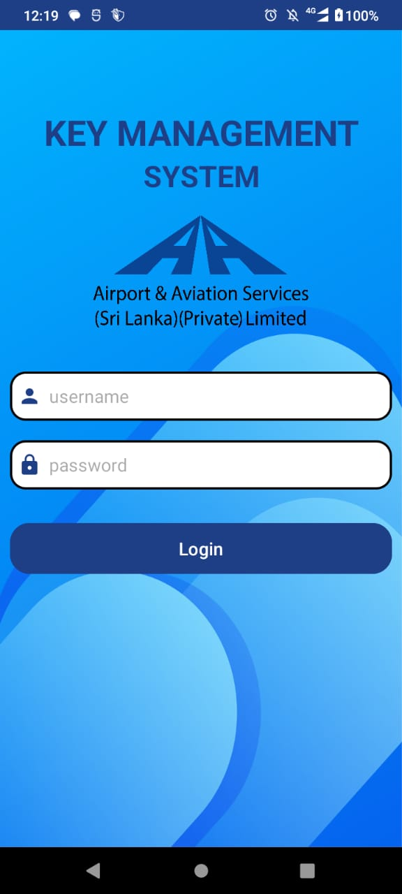
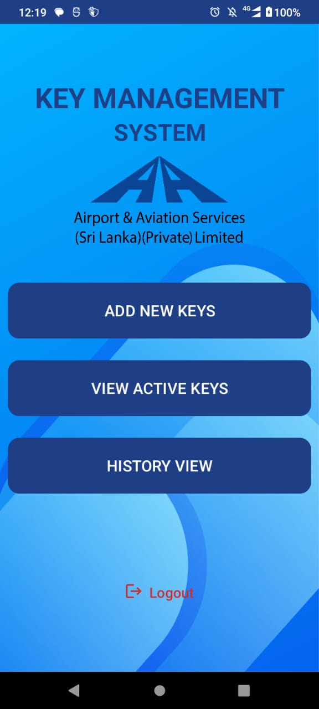
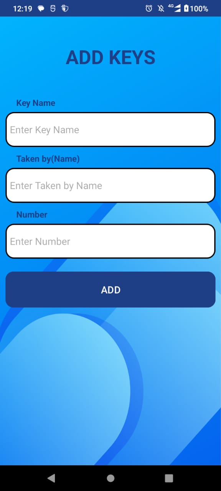
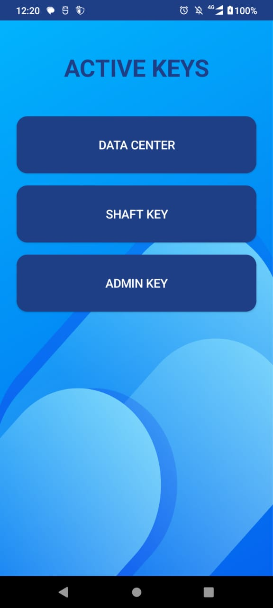
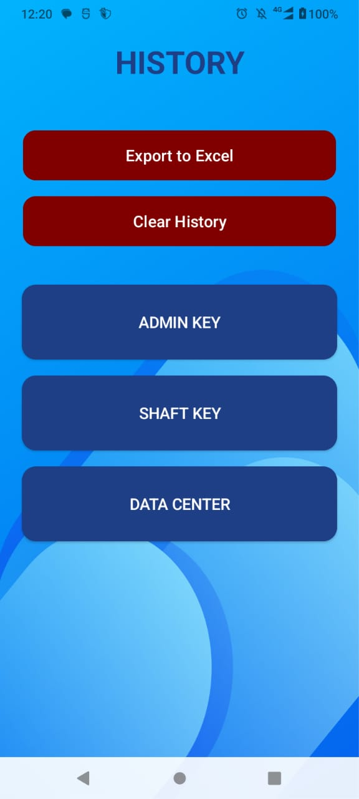
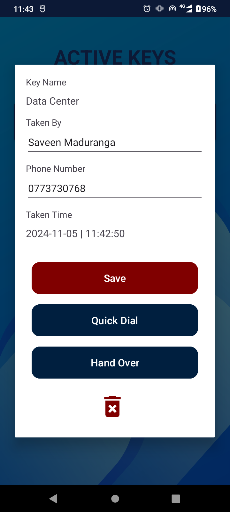
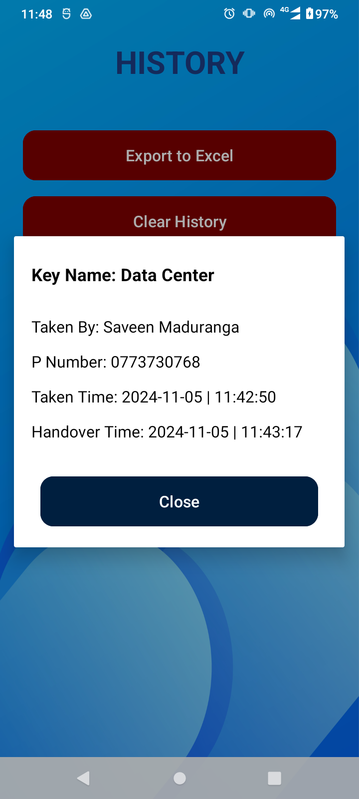

# Key Handover Management System

This mobile application is designed to streamline the management of key handovers for duty engineers, enhancing efficiency and accountability in key usage. Built with Flutter and Firebase, the app offers a user-friendly interface that allows users to easily manage key assignments, track handovers, and maintain a clear history of key activity.

## Features

- **User Authentication**: Secure login and registration using Firebase Authentication.
- **Key Management**: Add, edit, and remove keys with detailed information, including key numbers and assigned personnel.
- **Handover Tracking**: Log key handovers, capturing timestamps and user details for accountability.
- **History Log**: View and manage a comprehensive history of all key transactions, with the ability to clear history as needed.
- **Quick Dial Feature**: Easily contact responsible personnel with a one-click quick dial option.
- **Data Persistence**: Utilizes SQLite for local data storage, ensuring reliable access to key information even without an internet connection.
- **Background Operations**: Implements WorkManager for efficient background processing, including automated tasks such as clearing old data.

## Technologies Used

- Flutter
- Firebase
- SQLite
- Kotlin
- WorkManager

## Login Page UI

<table>
  <tr>
    <th>Login Page</th>
  </tr>
  <tr>
    <td></td>
  </tr>
</table>

## DashBoard UI

<table>
  <tr>
    <th>DashBoard</th>
    <th>Add Key Page</th>
    <th>Active Key Page</th>
    <th>History Page</th>
  </tr>
  <tr>
    <td></td>
    <td></td>
    <td></td>
    <td></td>
  </tr>
</table>

## Active Key Page UI

<table>
  <tr>
    <th>Active Key Page</th>
    <th>Active Key Popup Page</th>
  </tr>
  <tr>
    <td></td>
    <td></td>
  </tr>
</table>

## History Page UI

<table>
  <tr>
    <th>History Page</th>
    <th>History Popup Page</th>
  </tr>
  <tr>
    <td></td>
    <td></td>
  </tr>
</table>

## License

This project is licensed under the MIT License. See the [LICENSE](LICENSE) file for details.

